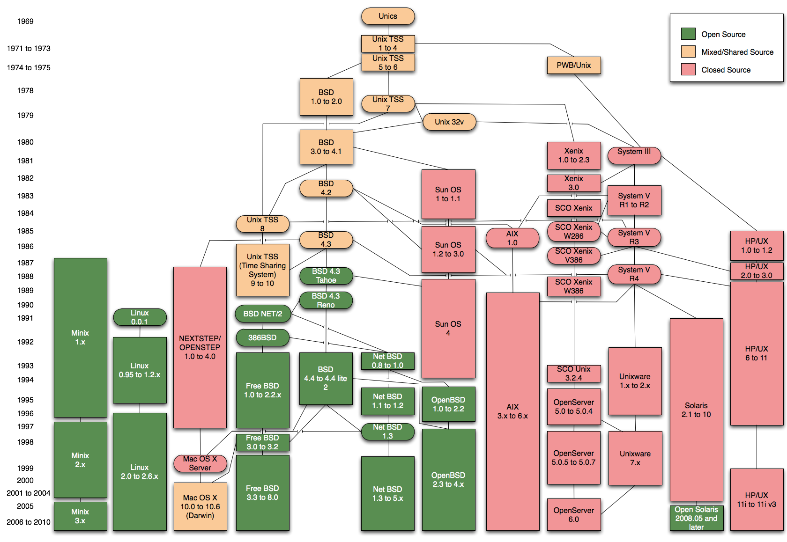

UNIX

Thomas de Grivel <thoxdg@gmail.com>

https://kmx.io/

2020-03-11

# UNIX

## History

### Diagram

### Multics

1960  

Companies

  - MIT
  
  - AT\&T Bell labs
  
  - General Electric

### UNIX

AT\&T Bell Labs 1970  

Developers

  - Ken Thompson
  
  - Dennis Ritchie

### Berkeley Unix

1974  

Licensed by AT\&T

### Berkeley Software Distribution

1979  

  - `vi`
  
  - `csh`

Licensed by AT\&T

### BSD License

    Copyright (c) <year> <copyright holder>.
    All rights reserved.
    
    Redistribution and use in source and binary forms are permitted
    provided that the above copyright notice and this paragraph are
    duplicated in all such forms and that any documentation,
    advertising materials, and other materials related to such
    distribution and use acknowledge that the software was developed
    by the <organization>. The name of the <organization> may not be
    used to endorse or promote products derived from this software
    without specific prior written permission.
    THIS SOFTWARE IS PROVIDED ``AS IS'' AND WITHOUT ANY EXPRESS OR
    IMPLIED WARRANTIES, INCLUDING, WITHOUT LIMITATION, THE IMPLIED
    WARRANTIES OF MERCHANTABILITY AND FITNESS FOR A PARTICULAR PURPOSE.

### Net/1

June 1989  

Basis for

  - NetBSD
  
  - FreeBSD

Under BSD License

### Minix

Andrew S. Tannenbaum

  - For teaching

  - Not BSD

  - GPL

### Linux

Linus Torvalds

  - Inspired by Minix

  - Not BSD

  - GPL

### NetBSD

Computer Systems Research Group of the University of California,
Berkeley

  - Started in 1993 from Net/2 and 386BSD

  - BSD License (two, three, and four-clause variants)

  - **Portable**

Founders :

  - Chris Demetriou

  - Theo de Raadt

  - Adam Glass

  - Charles Hannum

### FreeBSD

  - Started in 1993 also from 386BSD

  - FreeBSD 2.0 in 1994, without code from AT\&T

  - **Fast** `jemalloc` in base

### OpenBSD

Theo de Raadt

  - forked from NetBSD in 1995

  - **Secure by default**

  - Home of CARP, cwm, httpd, LibreSSL, OpenBGPD, OpenIKED,
    **OpenNTPD**, OpenOSPFD, OpenRsync, OpenSMTPD,
    **OpenSSH**, PF, pfsync, sndio, spamd, Xenocara

### Darwin

  - Forked from FreeBSD by Apple Inc. in 2000

  - Includes code from NeXTSTEP and Mach

  - Basis for MacOS X, iOS, iPadOS

  - Apple Public Source License (APSL), with closed-source drivers
