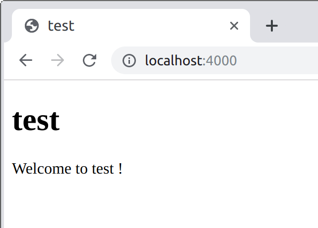

Rails On Lisp

Thomas de Grivel <thoxdg@gmail.com>

https://kmx.io/

2020-03-11

# Common Lisp

## Introduction

### Common Lisp

Common Lisp is the programmable programming language.

Lisp essays by Paul Graham
<http://www.paulgraham.com/lisp.html>

Standardised in 1994 by ANSI

Common Lisp the Language, 2nd Edition
<https://www.cs.cmu.edu/Groups/AI/html/cltl/cltl2.html>

Common Lisp Hyperspec
<http://www.lispworks.com/documentation/HyperSpec/Front/>

<http://cliki.net>

### Common Lisp

Several compilers implement the ANSI standard :

  - SBCL (open-source, x86, amd64, Windows, Linux, OSX, \*BSD)
    <http://sbcl.org>

  - ABCL (open-source, jvm)
    <https://abcl.org>

  - Clozure CL (open-source, x86, amd64, Windows, Linux, OSX, FreeBSD)
    <https://ccl.clozure.com>

  - ECL (open-source, compiles to C)
    <https://common-lisp.net/project/ecl/main.html>

  - LispWorks (proprietary, x86, amd64, Windows, Linux, OSX, FreeBSD)
    <http://www.lispworks.com/products/lispworks.html#personal>

  - Allegro CL (proprietary, x86, amd64, sparc, Windows, Linux, OSX,
    FreeBSD)
    <https://franz.com/products/allegrocl>

## Installation

### Install SBCL

Ubuntu :

```
  sudo apt-get install sbcl
```

MacOS X :

```
  brew install sbcl
```

### Install repo

```
mkdir -p ~/common-lisp/thodg
cd ~/common-lisp/thodg
git clone https://github.com/thodg/repo.git
cd ~/common-lisp
ln -s thodg/repo/repo.manifest
```

### Configure SBCL

Edit `~/.sbclrc`

```
  ;; ASDF
  (require :asdf)

  ;; repo
  (load "~/common-lisp/thodg/repo/repo")
  (repo:boot)
```

### Launch SBCL

    $ sbcl
    This is SBCL 1.5.3, an implementation of ANSI Common Lisp.
    More information about SBCL is available at <http://www.sbcl.org/>.

    SBCL is free software, provided as is, with absolutely no warranty.
    It is mostly in the public domain; some portions are provided under
    BSD-style licenses.  See the CREDITS and COPYING files in the
    distribution for more information.

    * _

### Install Slime

    * (repo:install :slime)

    $ /usr/bin/git -C /home/dx/common-lisp/slime clone https://github.com/slime/slime.git
    Cloning into 'slime'...

### Configure emacs

Edit ` ~/.emacs  `

```
  ;; Common Lisp
  (add-to-list 'load-path "~/common-lisp/slime/slime/")
  (require 'slime-autoloads)
  (add-to-list 'slime-contribs 'slime-fancy)
  (setq inferior-lisp-program
        "sbcl")
  (setq slime-net-coding-system
        'utf-8-unix)
```

## Demo

### Launch emacs and slime

    $ emacs

    M-x slime

    CL-USER> _

### The REPL

REPL : `read`, `eval`, `print
loop`

```
  (loop
    ;; setup REPL vars
    ;; handle errors, interactive debugger
    (print
      (eval
        (read)))
    (force-output)) ;; flush output buffers
```

### Symbols

A symbol compares faster than a string (pointers comparison).

To get a symbol through `eval` we have to quote it, with a single
quote prefix.

```
  ;; SLIME
  CL-USER> 'hello-world
  
  HELLO WORLD
  CL-USER> (quote hello-world)     ; equivalent sans syntaxe
  
  HELLO WORLD
```

<http://www.gigamonkeys.com/book/programming-in-the-large-packages-and-symbols.html>

### Symbols

If the symbol is not quoted then we end up in the interactive debugger :

```
  ;; SLIME
  CL-USER> hello-world

  The variable HELLO-WORLD is unbound.
     [Condition of type UNBOUND-VARIABLE]

  Restarts:
   0: [CONTINUE] Retry using HELLO-WORLD.
   1: [USE-VALUE] Use specified value.
   2: [STORE-VALUE] Set specified value and use it.
   3: [RETRY] Retry SLIME REPL evaluation request.
   4: [*ABORT] Return to SLIME's top level.

  Backtrace:
    0: (SB-INT:SIMPLE-EVAL-IN-LEXENV HELLO-WORLD #<NULL-LEXENV>)
    1: (EVAL HELLO-WORLD)
   --more--

  4
  ; Evaluation aborted on #<UNBOUND-VARIABLE HELLO-WORLD {1004AF3523}>.
  CL-USER> _
```

### Functions

`defun` defines a function.

If the first element of a list
(between parentheses) is a function or a symbol naming a function then
the list is treated as a function call.

```
  ;; SLIME
  CL-USER> (defun hello-world ()
             (format t "Hello world !"))
  HELLO-WORLD
  CL-USER> (hello-world)
  Hello world !
  NIL
  CL-USER> _
```

### Lambda

`lambda` introduces an anonymous function. We can affect an
anonymous function to a symbol, not unlike `defun`.

```
  ;; SLIME
  CL-USER> (setf (symbol-function 'hello-world)
                 (lambda ()
                   (format t "Hello world !")))

  CL-USER> (hello-world)
  Hello world !
  NIL
  CL-USER> _
```

### Higher order functions

A function is a value like others and can be passed to another function.

We call these functions higher order.

```
  ;; SLIME
  CL-USER> (mapcar (lambda (x) (* x x)) '(1 2 3 4 5))
  (1 4 9 16 25)
  CL-USER> (reduce #'+ '(1 2 3 4 5))
  15
  CL-USER> (reduce (function +) '(1 2 3 4 5)) ; equivalent to above
  15
  CL-USER> (reduce '+ '(1 2 3 4 5)) ; not equivalent will resolve
                                    ; function at run-time
  15
  CL-USER> _
```

### Macros

  - parameters are not evaluated -> DSL and
    meta-programming

  - generate code which is in turn evaluated

  - backquote and comma to quote only parts


```
  ;; SLIME
  CL-USER> (defmacro hello (arg)
             `(format nil "Hello ~A !"
                (string-capitalize ',arg)))
  HELLO
  CL-USER> (hello world)
  "Hello World !"
  CL-USER> (hello pony)
  "Hello Pony !"
  CL-USER> _
```

On Lisp, Paul Graham
<http://lib.store.yahoo.net/lib/paulgraham/onlisp.pdf>

### Quasiquotation

To quote entirely :
  `'(a b c)`
or
  `(quote (a b c))`
->
  `(a b c)`

To quote partially :
  `` `(a b ,c)``
or
  `(list 'a 'b c)`
->
  `(a b 123)` if `c = 123`

Backquote stops evaluation and comma reactivates it locally.

```
  ;; SLIME
  CL-USER> (let ((c 123))
             `(a b ,c))
  (A B 123)
```

# RailsOnLisp

## Installation

### Clone RailsOnLisp/rol.git

    $ mkdir ~/common-lisp/RailsOnLisp
    $ cd ~/common-lisp/RailsOnLisp
    $ git clone https://github.com/RailsOnLisp/rol.git
    Cloning into 'rol' ...

    $ _

### Configure PATH

Edit ` ~/.profile  `

```
  if [ -d "$HOME/common-lisp/RailsOnLisp/rol/bin" ]; then
      PATH="$HOME/common-lisp/RailsOnLisp/rol/bin:$PATH"
  fi
```

### Install RailsOnLisp

    $ . ~/.profile    # source ~/.profile ou launch a new shell
    $ rol install
    Cloning into 'rol-assets' ...
    Cloning into 'rol-files' ...
    Cloning into 'rol-log' ...
    Cloning into 'rol-server' ...
    Cloning into 'rol-skel' ...
    Cloning into 'rol-template' ...
    Cloning into 'rol-uri' ...

    $ ls -l ~/common-lisp/RailsOnLisp/rol

    $ _

## Demo

### rol new

    $ rol new test
    Creating test
    D .
    D ./config
    F ./config/app.lisp
    F ./config/routes.lisp
    F ./config/assets.lisp
    D ./data
    D ./lib
    L ./lib/rol -> /home/dx/common-lisp/RailsOnLisp/rol
    F ./Makefile
    D ./app
    D ./app/assets
    D ./app/assets/css
    F ./app/assets/css/app.css
    D ./app/assets/js
    F ./app/assets/js/app.js
    D ./app/views
    D ./app/views/_layouts
    [...]

    $ _

### make load

    $ cd test
    $ make load
    env LC_ALL=en_US.UTF-8 sbcl --disable-ldb --lose-on-corruption \
     --dynamic-space-size 512 --noinform --end-runtime-options \
     --eval '(declaim (optimize (debug 2) (safety 2) (speed 3) (space 1)))' \
     --disable-debugger \
     --load load.lisp \
     --eval '(run)' \
     --quit

    [...]

    INFO setup environment development
    DEBUG tags: ASSETS APP REPLY MIME FILE DIRECTORY THOT
    INFO saving facts into "data/test.facts"
    INFO starting thot at 0.0.0.0:4000

    INFO Thot start 0.0.0.0:4000
    INFO loading mime types from /etc/mime.types
    INFO #<FUNCTION THOT::MAIN-LOOP-THREADED>
    INFO  #<FUNCTION THOT::ACCEPTOR-LOOP-EPOLL>

### localhost:4000


